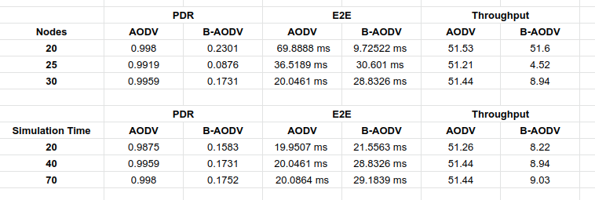

# BP-AODV
Blackhole Protected AODV for Network Design and Audit Course 2019

> Group 3:
> * 05111540000043 - Hafara Firdausi
> * 05111540000031 - Aulia T. Nururrahmah
> * 05111540007001 - Nabe Gedalia Razafindrobelina

This simple documentation created by Mocatfrio 😽

## Requirements
1. Debian based-Linux OS (Ubuntu, Linux Mint, etc)
2. Basic CLI skill

## 1. [NS2 Installation on Linux Mint](install-ns2.md)
## 2. Implementation
### 2.1 Adding Blackhole Attack Mechanism

1. Before modifying the original AODV code, create a backup by typing 
    ```bash
    cp -R ~/ns-allinone-2.35/ns-2.35/aodv ~/ns-allinone-2.35/ns-2.35/aodv-ori
    ```
2. Open **aodv** code using VSCode tool by typing `code ~/ns-allinone-2.35/ns-2.35/aodv`
3. Modify **aodv.h** file by adding following code under the history management:
    ```c
    /*
	 * History management
	 */
	
	double 		PerHopTime(aodv_rt_entry *rt);
    // Modification for blackhole attack
    nsaddr_t        malicious;
    ...
    ```
4. Modify **aodv.cc** file
    * Add `malicious=999;` in the **constructor** AODV::AODV(nsaddr_t).
        ```c
        ...
        LIST_INIT(&nbhead);
        LIST_INIT(&bihead);

        // modification - blackhole attack code  
        malicious = 999; 
        ...
        ```
    * Add following code in the **command** function:
        ```c
        int AODV::command(int argc, const char*const* argv) {
            if(argc == 2) {
                Tcl& tcl = Tcl::instance();
                if(strncasecmp(argv[1], "id", 2) == 0) {
                    tcl.resultf("%d", index);
                    return TCL_OK;
                }
            
                // Modification - blackhole attack code    
                if(strncasecmp(argv[1], "blackhole", 9) == 0) {
                    malicious = 1000;
                    return TCL_OK;
                }
        ...
        ```
    * Add following code in the **recvRequest** function to generate fake replies by blackhole attacker.
        ```c
        ...
        // Just to be safe, I use the max. Somebody may have
        // incremented the dst seqno.
        seqno = max(seqno, rq->rq_dst_seqno)+1;
        if (seqno%2) seqno++;

        sendReply(rq->rq_src,           // IP Destination
                    1,                    // Hop Count
                    index,                // Dest IP Address
                    seqno,                // Dest Sequence Num
                    MY_ROUTE_TIMEOUT,     // Lifetime
                    rq->rq_timestamp);    // timestamp
        
        Packet::free(p);
        }

        //  Modification - generate fake replies by blackhole attacker
        else if(malicious==1000) {
            seqno = max(seqno, rq->rq_dst_seqno)+1;
            if (seqno%2) seqno++;

            sendReply(rq->rq_src,           // IP Destination
                    1,                    // Hop Count
                    rq->rq_dst,
                    seqno,
                    MY_ROUTE_TIMEOUT,
                    rq->rq_timestamp);    // timestamp
            //rt->pc_insert(rt0->rt_nexthop);
            Packet::free(p);
        }  
        ...
        ```
    * Add following code in the **rt_resolve** function to disable send error message because Blackhole attacker doesn't have route to destination.
        ```c
        ...
        #ifdef DEBUG
            fprintf(stderr, "%s: sending RERR...\n", __FUNCTION__);
        #endif

            // modification - blackhole disable send (error)
            if(malicious==1000);
            else
                sendError(rerr, false);
        ...
        ```
5. The full code of blackhole-AODV can be found [here](aodv). Move it to your `~/ns-allinone-2.35/ns-2.35` directory.
    
### 2.2 Compiling
1. After modifying AODV code, don't forget to recompile NS-2
    ```bash
    cd ~/ns-allinone-2.35/ns-2.35
    sudo make clean
    sudo make
    sudo make install
    ```
2. Here's some bash scripts that will easier your life. Create these files in the `~/ns-allinone-2.35/ns-2.35` directory.
    * **Switcher** is used to switch from the AODV-ori code to AODV-blackhole, and vice versa.
        ```bash
        #!/bin/bash

        if [ $1 -eq 1 ] ; then
            # switch from aodv ori to aodv bp
            mv ~/ns-allinone-2.35/ns-2.35/aodv ~/ns-allinone-2.35/ns-2.35/aodv-ori
            mv ~/ns-allinone-2.35/ns-2.35/aodv-bp ~/ns-allinone-2.35/ns-2.35/aodv
            exit 1
        else
            # switch from aodv-bp to aodv ori
            mv ~/ns-allinone-2.35/ns-2.35/aodv ~/ns-allinone-2.35/ns-2.35/aodv-bp
            mv ~/ns-allinone-2.35/ns-2.35/aodv-ori ~/ns-allinone-2.35/ns-2.35/aodv
            exit 1
        fi  
        ```
        ```bash
        bash switch.sh 1
        bash switch.sh 2
        ```

    * **Compiler** is used to recompile NS-2
        ```bash
        #!/bin/bash
        
        make clean
        make 
        make install
        ```
        ```bash
        # dont forget to use SUDO
        sudo bash make.sh
        ```

### 2.3 Simple Simulation

1. **Scenario**
   * Number of nodes : 20, 25, 30 nodes (25)
   * Simulation time : 40, 70, 100 second (40)
   * Routing protocol : AODV and Blackhole-AODV
   * Area : 1186 x 600
2. Make TCL scripts to conduct the simulation : [Here's the scripts](scenario/tcl-scripts)
3. Run the scripts as usual, for example: 
    ```bash
    ns BAODV_20.tcl
    ```
    It will generate an output file.
4. Analyze the output file using AWK scripts to get the **PDR** (Packet Delivery Ratio), **End-to-end Delay**, and **Througput** : [Here's the scripts](scenario/awk-scripts)

### 2.4 Experiment Results 



Based on our experiment, AODV-blackhole has a smaller PDR (Packet Delivery Ratio) than the AODV-ori. Hence, we implement BP-AODV to solve the blackhole problem.


## 3. [Detailed Simulation and Evaluation](simulation.md)

## References
* A. M. El-Semary and H. Diab, "BP-AODV: Blackhole Protected AODV Routing Protocol for MANETs Based on Chaotic Map," in IEEE Access, vol. 7, pp. 95197-95211, 2019.
* Blackhole attack code tutorial : http://www.jgyan.com/ns2/blackhole%20attack%20simulation%20in%20ns2.php
* https://github.com/achiv/MANETs-under-Black-hole-attack