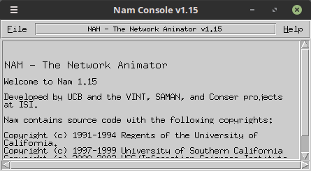

# 1. Installing NS-2 on Linux Mint 

> **Disclaimer**: This documentation not the same as documentation written by Mas Aldo [here](https://docs.google.com/document/d/1cNnfd57Okh_KwuJOJv95aE1d1jWxz2UgYWMCLUgepvU/edit) because I use the different OS.

## 1.1 Description
NS-2 is an open-source network simulator targeted for network research. NS-2 provides substantial support for TCP, routing, and multicast protocol simulations, both through wired and wireless networks. NS-2 uses TCL language (Tool Command Language), a string-based command language created by John Ousterhout in the late 1980s as a command language with interactive tools.


   
## 1.3 Steps
### 1.3.1 Preparation
1. Download the NS-2.35 installer [here](http://sourceforge.net/projects/nsnam/) or [here (for gcc-5)](https://intip.in/downloadns2).
2. Move the downloaded installer into the home directory (symbolized by `~`).
    ```bash
    mv ~/Downloads/ns-allinone-2.35.tar.gz ~/ns-allinone-2.35.tar.gz
    ```

3. Change to the home directory and extract the file.
    ```bash
    tar zxvf ns-allinone-2.35.tar.gz
    ```

### 1.3.2 Installing Dependencies
1. Install **gcc-4.4** and **g++-4.4** as a requirement of NS-2.35.
    ```bash
    sudo add-apt-repository ppa:ubuntu-toolchain-r/test
    sudo apt-get update
    sudo apt-get install gcc-4.4 g++-4.4
    ```
2. Install some required dependencies.
    ```bash
    sudo apt-get install build-essential automake autoconf libxmu-dev
    ```

### 1.3.3 Installing NS-2.35
1. Open the `ls.h` file in the `ns-2.35/linkstate/` directory.
    ```bash
    nano ~/ns-allinone-2.35/ns-2.35/linkstate/ls.h
    ```
   And change this line by adding `this->` before `erase` to be:
    ```bash
    void eraseAll() { this->erase(baseMap::begin(), baseMap::end()); }
    ```
2. Open the `Makefile.in` in the `otcl-1.14/` directory.
    ```bash
    nano ~/ns-allinone-2.35/otcl-1.14/Makefile.in
    ```
    And change these lines:
    ```bash
    CC=     gcc-4.4 # edit this line
    CXX=    gcc-4.4 # add this line
    ```
3. Export GCC if you have more than 1 version of GCC.
    ```bash
    export CC=gcc-4.4 CXX=g++-4.4
    ```
4. Back to the `~/ns-allinone-2.35` directory, then install NS-2.35:
    ```bash
    ./install
    ```
    Wait until the installation process is finished.

5. If you find an error like this, don't panic. We just need to set the environment (in the .bashrc file).  
    ```bash
    Please put /home/mocatfrio/ns-allinone-2.35/bin:/home/mocatfrio/ns-allinone-2.35/tcl8.5.10/unix:/home/mocatfrio/ns-allinone-2.35/tk8.5.10/unix
    into your PATH environment; so that you\'ll be able to run itm/tclsh/wish/xgraph.

    IMPORTANT NOTICES:

    (1) You MUST put /home/mocatfrio/ns-allinone-2.35/otcl-1.14, /home/mocatfrio/ns-allinone-2.35/lib, 
        into your LD_LIBRARY_PATH environment variable.
        If it complains about X libraries, add path to your X libraries 
        into LD_LIBRARY_PATH.
        If you are using csh, you can set it like:
        setenv LD_LIBRARY_PATH <paths>
        If you are using sh, you can set it like:
        export LD_LIBRARY_PATH=<paths>

    (2) You MUST put /home/mocatfrio/ns-allinone-2.35/tcl8.5.10/library into your TCL_LIBRARY environmental
        variable. Otherwise ns/nam will complain during startup.
    ```
6. Open the **.bashrc** file.
    ```bash
    nano ~/.bashrc
    ```
    Add these lines at the bottom row:
    ```bash
    #LD_LIBRARY_PATH
    OTCL_LIB=/home/mocatfrio/ns-allinone-2.35/otcl-1.14/
    NS2_LIB=/home/mocatfrio/ns-allinone-2.35/lib/
    USR_Local_LIB=/usr/local/lib/
    export LD_LIBRARY_PATH=$LD_LIBRARY_PATH:$OTCL_LIB:$NS2_LIB:$USR_Local_LIB

    # TCL_LIBRARY
    TCL_LIB=/home/mocatfrio/ns-allinone-2.35/tcl8.5.10/library/
    USR_LIB=/usr/lib/
    export TCL_LIBRARY=$TCL_LIBRARY:$TCL_LIB:$USR_LIB

    # PATH
    XGRAPH=/home/mocatfrio/ns-allinone-2.35/xgraph-12.2/:/home/mocatfrio/ns-allinone-2.35/bin/:/home/mocatfrio/ns-allinone-2.35/tcl8.5.10/unix/:/home/mocatfrio/ns-allinone-2.35/tk8.5.10/unix/
    NS=/home/mocatfrio/ns-allinone-2.35/ns-2.35/
    NAM=/home/mocatfrio/ns-allinone-2.35/nam-1.15/
    export PATH=$PATH:$XGRAPH:$NS:$NAM
    ```
    Save and execute **.bashrc** file.
    ```bash
    source ~/.bashrc
    ```
7. Validate the NS-2 to make sure everything goes well. This validation process will take about half an hour.
    ```bash
    cd ~/ns-allinone-2.35/ns-2.35/
    ./validate
    ```
    Validation is complete:
    ```bash
    SORTING LISTS ...DONE!
    NS EXITING...
    finishing..
    Test output agrees with reference output
    Running test dsr:
    ../../ns test-suite-wireless-tdma.tcl dsr QUIET
    num_nodes is set 50
    INITIALIZE THE LIST xListHead
    Loading connection pattern...
    Loading scenario file...
    Load complete...
    Starting Simulation...
    channel.cc:sendUp - Calc highestAntennaZ_ and distCST_
    highestAntennaZ_ = 1.5,  distCST_ = 550.0
    SORTING LISTS ...DONE!
    NS EXITING...
    finishing..
    Test output agrees with reference output
    All test output agrees with reference output.
    Tue Oct 16 06:32:06 WIB 2018
    These messages are NOT errors and can be ignored:
        warning: using backward compatibility mode
        This test is not implemented in backward compatibility mode


    validate overall report: all tests passed
    ```
    p.s. Pay attention during the validation process. If it fails, stop the process and read the error. Usually, some dependencies are not installed on your PC.
8. The installation process is complete!

> Note:
> * Installing NS-2 on Ubuntu 14.04 [here](https://www.howtoforge.com/tutorial/ns2-network-simulator-on-ubuntu-14.04/)
> * Installing NS 2 on Ubuntu 16.04 [here](https://docs.google.com/document/d/1cNnfd57Okh_KwuJOJv95aE1d1jWxz2UgYWMCLUgepvU/edit)
> * Installing NS-2 on Ubuntu 18.04 [here](https://www.nsnam.com/2018/06/installation-of-ns2-in-ubuntu-1804.html)
> * Installing NS-2 on Debian 9.4 [here](https://docs.google.com/document/d/1iEMl5YeRZ35RjkIbV34BGF126x4_elja6ceYwGHyGFk/edit)

### 4. Testing
1. Open a terminal.
2. Type `ns` command in the terminal to open the NS-2 interface. If `%` symbol appears, then NS-2 is installed correctly.
3. Type `nam` command in the terminal to open the network animator. If a network animator window pops up like below, then NAM is successfully installed.

    

    In some cases, if NAM is not installed correctly, a "Segmentation fault" message will appear in the terminal.

## References
https://www.techerina.com/2015/02/installing-ns-235-in-linux-mint-171.html